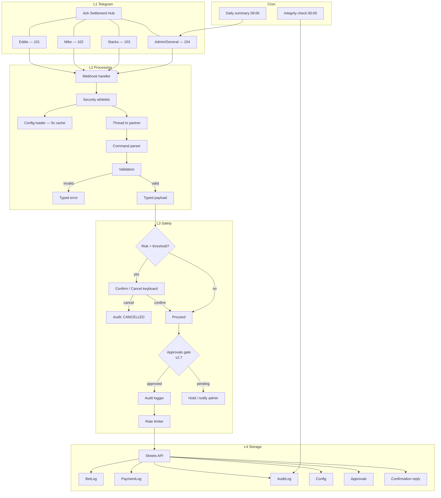

# Ash Settlement Bot — Project Outline

Architecture, planned layout, and phased delivery for **spec v2.6**. Field-level tables, edge-case matrix, and interactive demo live in [spec.html](spec.html).

| | |
|---|---|
| **Status** | Spec v2.6 · documentation complete · **not yet implemented** |
| **Start here** | [README.md](README.md) (DOC-01) · Ref IDs: [REFS.md](REFS.md) (DOC-04) |

## Contents

- [Problem and goals](#problem-and-goals)
- [Architecture layers](#architecture-layers)
- [Reference registry](#reference-registry)
- [REFS.md](REFS.md)
- [Bun API references](#bun-api-references)
- [Effect references](#effect-references)
- [grammY & Telegram references](#grammy--telegram-references)
- [Google Sheets references](#google-sheets-references)
- [Planned directory layout](#planned-directory-layout)
- [Command catalog](#command-catalog)
- [Sheet contracts](#sheet-contracts-summary)
- [Config schema](#config-schema-index)
- [Edge cases](#edge-cases-index)
- [Implementation phases](#implementation-phases)
- [Future enhancements](#future-enhancements)
- [Spec cross-reference](#spec-cross-reference)

---

## Problem and goals

Ash logs bets for multiple partners in one Telegram supergroup. Each partner uses a dedicated forum topic. Running totals and P&L must stay correct without manual spreadsheet fixes after every command.

| Goal | Mechanism |
|------|-----------|
| Zero mis-logged bets | Strict `message_thread_id` → partner mapping |
| Typo protection | Inline keyboard when `risk > big_ticket_threshold` |
| High-stakes governance | Domain approvals — Risk / Finance / Compliance / Ops ([SPEC-10](REFS.md#ref-spec-10)) |
| Self-service config | Config sheet tab, 5-second reload |
| Autonomous visibility | Daily P&L digest + midnight integrity check |

---

## Architecture layers

| Layer | Responsibility | Planned modules |
|-------|----------------|-----------------|
| **L1 — Telegram** | Supergroup, forum topics, webhooks | grammY bot, webhook handler |
| **L2 — Processing** | Security, config, mapping, parsing | `ConfigService`, `PartnerMapper`, Effect Schema parsers |
| **L3 — Safety** | Confirmations, rate limits, audit, approvals (v2.7) | `PendingBetStore`, callback handlers, `AuditLogger`, `ApprovalService` |
| **L4 — Storage** | Sheet I/O, config cache | `SheetApiService`, tab appenders (`BetLog`, `PaymentLog`, `AuditLog`, `Config`, `Approvals`) |
| **Cron** | Background jobs | `dailySummaryJob`, `integrityCheckJob`, `weeklyReportJob`, `leaderboardCacheJob` |

### Request flow

Canonical diagram: [spec.html#architecture](spec.html#architecture).



### Bun API references

Official docs for Bun primitives. Registry: [REFS.md](REFS.md#bun-b01-b08).

| Ref ID | API | Documentation | Where in project | Related SPEC |
|--------|-----|---------------|------------------|--------------|
| [B01](REFS.md#ref-b01) | Runtime | [Overview](REFS.md#ref-b01) | TypeScript runtime and tooling | — |
| [B02](REFS.md#ref-b02) | `bun-types` | [TypeScript](REFS.md#ref-b02) | Strict typing across `src/` | — |
| [B03](REFS.md#ref-b03) | `Bun.serve` | [HTTP server](REFS.md#ref-b03) | `src/index.ts` — webhook endpoint | [SPEC-08](REFS.md#ref-spec-08) |
| [B04](REFS.md#ref-b04) | `Bun.cron` | [Cron scheduler](REFS.md#ref-b04) | `src/cron/` — daily summary, integrity check | [SPEC-03](REFS.md#ref-spec-03) |
| [B05](REFS.md#ref-b05) | `Bun.env` | [Environment variables](REFS.md#ref-b05) | Token, sheet ID, cache TTL | [SPEC-02](REFS.md#ref-spec-02) |
| [B06](REFS.md#ref-b06) | `Bun.file` | [File I/O](REFS.md#ref-b06) | `config.example.json`, service-account JSON | — |
| [B07](REFS.md#ref-b07) | install | [Package manager](REFS.md#ref-b07) | Dependency setup (future) | — |
| [B08](REFS.md#ref-b08) | Test runner | [Test runner](REFS.md#ref-b08) | Unit/integration tests (future) | — |

**Cross-links:** [README — Reference registry](README.md#reference-registry) · [spec — Scheduled jobs](spec.html#scheduled-jobs) · [spec — Architecture](spec.html#architecture)

### Effect references

| Ref ID | API | Documentation | Where in project | Related SPEC |
|--------|-----|---------------|------------------|--------------|
| [E01](REFS.md#ref-e01) | Overview | [Effect docs](REFS.md#ref-e01) | Typed services, error handling | — |
| [E02](REFS.md#ref-e02) | Schema | [Schema introduction](REFS.md#ref-e02) | Command parsers, config validation | [SPEC-02](REFS.md#ref-spec-02), [SPEC-05](REFS.md#ref-spec-05) |
| [E03](REFS.md#ref-e03) | Layers | [Requirements management](REFS.md#ref-e03) | `ConfigService`, `SheetApiService` | [SPEC-08](REFS.md#ref-spec-08) |
| [E04](REFS.md#ref-e04) | Retry | [Retrying](REFS.md#ref-e04) | Cron error recovery | [SPEC-03](REFS.md#ref-spec-03) |
| [E05](REFS.md#ref-e05) | `Effect.gen` | [Getting started](REFS.md#ref-e05) | `dailySummaryJob`, handlers | [SPEC-03](REFS.md#ref-spec-03) |

**Cross-links:** [README — Reference registry](README.md#reference-registry) · [spec — Edge cases](spec.html#edge-cases)

### grammY & Telegram references

| Ref ID | API | Documentation | Where in project | Related SPEC |
|--------|-----|---------------|------------------|--------------|
| [T01](REFS.md#ref-t01) | grammY | [Guide](REFS.md#ref-t01) | `src/bot.ts` command routing | [SPEC-04](REFS.md#ref-spec-04) |
| [T02](REFS.md#ref-t02) | Webhooks | [Deployment types](REFS.md#ref-t02) | `Bun.serve` [B03](REFS.md#ref-b03) webhook handler | [SPEC-08](REFS.md#ref-spec-08) |
| [T03](REFS.md#ref-t03) | Inline keyboards | [Keyboard plugin](REFS.md#ref-t03) | Big-ticket confirm flow | [SPEC-05](REFS.md#ref-spec-05), [SPEC-07](REFS.md#ref-spec-07), [SPEC-09](REFS.md#ref-spec-09), [SPEC-10](REFS.md#ref-spec-10) |
| [T04](REFS.md#ref-t04) | Forum topics | [Bot API — forum topics](REFS.md#ref-t04) | Strict `message_thread_id` mapping | [SPEC-04](REFS.md#ref-spec-04), [SPEC-07](REFS.md#ref-spec-07) |
| [T05](REFS.md#ref-t05) | Bot API | [Telegram Bot API](REFS.md#ref-t05) | Updates, callbacks | [SPEC-04](REFS.md#ref-spec-04) |

**Cross-links:** [README — Reference registry](README.md#reference-registry) · [spec — Command matrix](spec.html#command-matrix) · [spec — Demo](spec.html#mockup)

### Google Sheets references

| Ref ID | API | Documentation | Where in project | Related SPEC |
|--------|-----|---------------|------------------|--------------|
| [S01](REFS.md#ref-s01) | Concepts | [Sheets API overview](REFS.md#ref-s01) | Spreadsheet and tab layout | [SPEC-06](REFS.md#ref-spec-06) |
| [S02](REFS.md#ref-s02) | Append | [Append values](REFS.md#ref-s02) | BetLog, PaymentLog, AuditLog | [SPEC-06](REFS.md#ref-spec-06) |
| [S03](REFS.md#ref-s03) | Read | [Read values](REFS.md#ref-s03) | Config tab, cron totals | [SPEC-02](REFS.md#ref-spec-02) |
| [S04](REFS.md#ref-s04) | Auth | [Service account](REFS.md#ref-s04) | Credentials | — |
| [S05](REFS.md#ref-s05) | REST | [values.append](REFS.md#ref-s05) | HTTP API reference | [SPEC-06](REFS.md#ref-spec-06) |

**Cross-links:** [README — Reference registry](README.md#reference-registry) · [spec — Sheet contracts](spec.html#sheet-contracts)

---

## Reference registry

Canonical Ref IDs: **[REFS.md](REFS.md)** (DOC-04) · machine-readable **[refs.json](refs.json)** (validated by `bun run audit:refs`).

| Prefix | Range | Link |
|--------|-------|------|
| B | B01–B08 | [REFS.md#bun-b01-b08](REFS.md#bun-b01-b08) |
| E | E01–E05 | [REFS.md#effect-e01-e05](REFS.md#effect-e01-e05) |
| T | T01–T05 | [REFS.md#grammy-telegram-t01-t05](REFS.md#grammy-telegram-t01-t05) |
| S | S01–S05 | [REFS.md#google-sheets-s01-s05](REFS.md#google-sheets-s01-s05) |
| SPEC | SPEC-01–SPEC-10 | [REFS.md#internal-spec-sections](REFS.md#internal-spec-sections) |
| DOC | DOC-01–DOC-04 | [REFS.md#project-documents](REFS.md#project-documents) |

**Key pairings:** [REFS.md#key-pairings](REFS.md#key-pairings) · **Cross-reference matrix:** [REFS.md#cross-reference-matrix](REFS.md#cross-reference-matrix) · Detail tables: [OUTLINE.md](OUTLINE.md#bun-api-references)

---

## Planned directory layout

Future structure — **no source files exist yet**.

```
bet-turnin-sheet/
├── refs.json                 # Canonical registry (SSOT)
├── REFS.md                   # DOC-04 — human-readable registry
├── README.md                 # DOC-01
├── OUTLINE.md                # DOC-02
├── spec.html                 # DOC-03
├── docs/                     # later: SETUP.md, SHEETS.md
├── src/
│   ├── index.ts              # Bun.serve webhook + cron bootstrap
│   ├── bot.ts                # grammY setup, command routing
│   ├── config/               # Effect schema + ConfigService
│   ├── commands/             # logbet, settle, payment, approvals, ...
│   ├── safety/               # big-ticket keyboard, rate limiter
│   ├── approvals/            # ApprovalService, domain gates (v2.7 · SPEC-10)
│   ├── sheets/               # Google Sheets client + writers
│   ├── cron/                 # scheduled jobs
│   └── schemas/              # BetPayload, PaymentPayload, ...
├── scripts/
│   ├── audit-refs.ts         # Ref registry audit CLI
│   └── refs-schema.ts        # Zod validation
├── ref-audit.json            # Latest audit report
└── .env.example
```

### Entry point (planned)

```typescript
// B03 — Bun.serve webhook · REFS.md#ref-b03
import { startBot } from "./bot";
import { registerCronJobs } from "./cron";

await startBot();
registerCronJobs();
```

### Cron pattern (planned)

From [spec.html#scheduled-jobs](spec.html#scheduled-jobs):

```typescript
import { Effect } from "effect";

// B04 — daily summary cron · REFS.md#ref-b04
// E04 — retry · E05 — Effect.gen · REFS.md#ref-e04 · REFS.md#ref-e05
Bun.cron("daily_summary", {
  pattern: "0 9 * * *",
  timezone: "America/Los_Angeles",
  async run() {
    await Effect.runPromise(
      dailySummaryJob.pipe(
        Effect.retry({ times: 3, delay: 1000 }),
        Effect.catchAll((err) => Effect.logError("Cron failed", err))
      )
    );
  },
});
```

---

## Command catalog

Full matrix: [spec.html#command-matrix](spec.html#command-matrix) · [SPEC-04](REFS.md#ref-spec-04).

### Core

| Command | Behavior | Ref IDs |
|---------|----------|---------|
| `/logbet` | Log straight bet or parlay | [SPEC-04](REFS.md#ref-spec-04) · [E02](REFS.md#ref-e02) · [S02](REFS.md#ref-s02) |
| `/status` | Last 5 bets + running total (partner topic) | [SPEC-04](REFS.md#ref-spec-04) |
| `/settle` | Partner total; General topic → master total | [SPEC-04](REFS.md#ref-spec-04) · [SPEC-07](REFS.md#ref-spec-07) |
| `/payment` | Log settlement payment | [SPEC-04](REFS.md#ref-spec-04) · [S02](REFS.md#ref-s02) |
| `/listpartners` | Active partners list | [SPEC-04](REFS.md#ref-spec-04) · [SPEC-02](REFS.md#ref-spec-02) |

### Extended (v2.6 demo)

| Command | Behavior | Ref IDs |
|---------|----------|---------|
| `/editbet` | Update row; recalculate totals; audit entry | [SPEC-04](REFS.md#ref-spec-04) · [SPEC-06](REFS.md#ref-spec-06) |
| `/leaderboard` | Rank partners by P&L | [SPEC-04](REFS.md#ref-spec-04) |
| `/settleup` | Settlement summary + payment deep links | [SPEC-04](REFS.md#ref-spec-04) · [SPEC-09](REFS.md#ref-spec-09) |
| `/check` | Verify bot math vs sheet formulas | [SPEC-03](REFS.md#ref-spec-03) · [SPEC-06](REFS.md#ref-spec-06) |

### Approval commands (v2.7)

| Command | Behavior | Ref IDs |
|---------|----------|---------|
| `/approvals pending` | List open approval requests (admin) | [SPEC-10](REFS.md#ref-spec-10) · [SPEC-04](REFS.md#ref-spec-04) |
| `/approve <id>` | Approve request; unblock downstream action | [SPEC-10](REFS.md#ref-spec-10) |
| `/reject <id>` | Reject request; log to AuditLog | [SPEC-10](REFS.md#ref-spec-10) |

### Admin and context rules

- **`--force`** — `admin_user_ids` only; cross-topic log allowed; `Admin_Override` + `ADMIN_OVERRIDE` audit
- **Cross-topic (non-admin)** — rejected: *Switch to their topic*
- **`/logbet` in General** — rejected · **`/settle` in General** — allowed

Interactive examples: [spec.html#mockup](spec.html#mockup).

---

## Sheet contracts summary

Full specs: [spec.html#sheet-contracts](spec.html#sheet-contracts) · [SPEC-06](REFS.md#ref-spec-06).

| Tab | Role | Ref IDs |
|-----|------|---------|
| **BetLog** | Bot writes A–I, L, M. Formulas: **Result** `=IF(I2="W",H2*(G2/100),IF(I2="L",-H2,0))`, **Running_Total** `=SUM(J$2:J2)` | [S02](REFS.md#ref-s02) · [S01](REFS.md#ref-s01) |
| **PaymentLog** | Payments; negative amount = Ash pays partner | [S02](REFS.md#ref-s02) |
| **AuditLog** | Immutable log with `Payload_JSON` | [S02](REFS.md#ref-s02) |
| **Config** | Live config; polled every 5s | [S03](REFS.md#ref-s03) · [SPEC-02](REFS.md#ref-spec-02) |
| **Approvals** | Central sign-off audit trail (v2.7) | [SPEC-10](REFS.md#ref-spec-10) · [S02](REFS.md#ref-s02) |

**AuditLog actions:** `BET_LOGGED` · `PAYMENT_LOGGED` · `CONFIRM_CLICKED` · `CANCELLED` · `REJECTED` · `ADMIN_OVERRIDE` · `APPROVAL_REQUESTED` · `APPROVAL_GRANTED` · `APPROVAL_REJECTED` (v2.7)

---

## Config schema index

Full table: [spec.html#hub-config](spec.html#hub-config) · [SPEC-02](REFS.md#ref-spec-02) · [E02](REFS.md#ref-e02).

| Group | Paths |
|-------|-------|
| Hub | `hub.chat_id`, `hub.name`, `general_topic_id` |
| Partners | `partners[].key`, `.thread_id`, `.display_name`, `.is_active`, `.settle_threshold` |
| Access | `admin_user_ids[]` |
| Rate limit | `rate_limit.commands_per_minute`, `rate_limit.burst_size` |
| Safety | `big_ticket_threshold`, `approval_thresholds` |
| Cron | `scheduled_jobs.timezone`, `scheduled_jobs.daily_summary.*`, `scheduled_jobs.weekly_report.*` |

---

## Edge cases index

Full table: [spec.html#edge-cases](spec.html#edge-cases) · [SPEC-05](REFS.md#ref-spec-05) · Approvals: [SPEC-10](REFS.md#ref-spec-10)

**Rejected — not written to AuditLog**

- DM to bot · `/logbet` in General · rate/burst limit · schema validation failure · unknown/inactive topic · cross-topic without `--force`

**Written to AuditLog**

- Big-ticket confirm/cancel · `/settle` in General · `--force` overrides · successful bet/payment writes
- Approval granted/rejected (v2.7 · [SPEC-10](REFS.md#ref-spec-10))

---

## Implementation phases

<a id="phase-0"></a>

### Phase 0 — Docs and spec alignment ✓

**Ref IDs:** [SPEC-08](REFS.md#ref-spec-08) · [DOC-01–04](REFS.md#project-documents)

- [x] README.md entrypoint
- [x] OUTLINE.md architecture and phases
- [x] Cross-links to spec.html

<a id="phase-1"></a>

### Phase 1 — Config in Sheets

**Ref IDs:** [SPEC-02](REFS.md#ref-spec-02) · [E02](REFS.md#ref-e02) · [B05](REFS.md#ref-b05) · [S03](REFS.md#ref-s03)

**Deliverables:** `ConfigService` (5s TTL) · Effect schema · JSON dev fallback

**Acceptance criteria**

- Config tab edits visible within 5 seconds
- Invalid values fail schema validation with typed errors
- Dev mode runs from `config.example.json` without Sheets

<a id="phase-2"></a>

### Phase 2 — Core path: `/logbet`

**Ref IDs:** [SPEC-04](REFS.md#ref-spec-04) · [SPEC-06](REFS.md#ref-spec-06) · [B03](REFS.md#ref-b03) · [T02](REFS.md#ref-t02) · [E02](REFS.md#ref-e02) · [S02](REFS.md#ref-s02)

**Deliverables:** Webhook · security whitelist · thread mapping · BetLog append · confirmation reply

**Acceptance criteria**

- Partner-topic bet appears in BetLog with correct `partners[].key`
- `/logbet` in General rejected
- Unknown `thread_id` returns *Unknown topic*

<a id="phase-3"></a>

### Phase 3 — Big-ticket keyboard

**Ref IDs:** [SPEC-05](REFS.md#ref-spec-05) · [SPEC-07](REFS.md#ref-spec-07) · [SPEC-09](REFS.md#ref-spec-09) · [T03](REFS.md#ref-t03) · evolves to [SPEC-10](REFS.md#ref-spec-10) in Phase 7

**Deliverables:** Threshold check · pending bet store · `confirm_bet` / `cancel_bet` callbacks

**Acceptance criteria**

- No sheet write until Confirm when `risk > big_ticket_threshold`
- Cancel → AuditLog `CANCELLED`
- Confirm → AuditLog `CONFIRM_CLICKED`, then BetLog row

<a id="phase-4"></a>

### Phase 4 — Daily summary cron

**Ref IDs:** [SPEC-03](REFS.md#ref-spec-03) · [B04](REFS.md#ref-b04) · [E04](REFS.md#ref-e04) · [E05](REFS.md#ref-e05)

**Deliverables:** `fetchYesterdaysTotals()` · formatted Admin-topic post · enable toggle

**Acceptance criteria**

- Fires at configured cron in `scheduled_jobs.timezone`
- Message lists per-partner and total yesterday P&L
- Retries 3× on failure; errors logged

<a id="phase-5"></a>

### Phase 5 — Integrity check cron

**Ref IDs:** [SPEC-03](REFS.md#ref-spec-03) · [B04](REFS.md#ref-b04)

**Deliverables:** Midnight `/check` for all partners · mismatch reporting

**Acceptance criteria**

- Detects manual formula drift on BetLog
- No false positives on clean data
- Mismatches in AuditLog or Admin alert

<a id="phase-6"></a>

### Phase 6 — Extended features

**Ref IDs:** [SPEC-09](REFS.md#ref-spec-09) · [SPEC-04](REFS.md#ref-spec-04)

**Deliverables:** Parlay parser · `/editbet` · `/leaderboard` · `/settleup` · weekly PDF · leaderboard cache

**Acceptance criteria**

- Combined parlay odds correct
- Edit recalculates totals + audit entry
- Weekly PDF posts to Admin when enabled

<a id="phase-7"></a>

### Phase 7 — Domain approval layer (v2.7)

**Ref IDs:** [SPEC-10](REFS.md#ref-spec-10) · [SPEC-06](REFS.md#ref-spec-06) · [SPEC-04](REFS.md#ref-spec-04) · [S02](REFS.md#ref-s02) · [E02](REFS.md#ref-e02) · [T03](REFS.md#ref-t03)

**Deliverables:** `Approvals` tab · `BetLog`/`PaymentLog` sign-off columns · `/approvals` · `/approve` · `/reject` · `approval_thresholds` in config

**Acceptance criteria**

- Big-ticket bet persists `Risk_Signoff_*` (or `Approvals` row) on confirm
- `/settleup` above finance threshold requires approval before payment link
- `/editbet` and `--force` log Operations approval
- `strict_mode` blocks writes until approval status is `approved`

Spec: [spec.html#domain-approvals](spec.html#domain-approvals) · Pairing: [REFS.md#key-pairings](REFS.md#key-pairings)

---

## Future enhancements

| Enhancement | Layer | Notes |
|-------------|-------|-------|
| Domain approval layer | Safety → Storage | [Phase 7](OUTLINE.md#phase-7) · [SPEC-10](REFS.md#ref-spec-10) |
| Partner web dashboard | Storage → External | Read-only per-partner totals |
| Anomaly detection | Safety | Unusual pattern alerts |
| Multi-currency odds | Parser | Decimal / fractional / American |
| Slack / Discord webhooks | Output | Big-bet alerts off Telegram |

---

## Spec cross-reference

| This outline | spec.html | Ref IDs |
|--------------|-----------|---------|
| Architecture layers | [#architecture](spec.html#architecture) | [SPEC-08](REFS.md#ref-spec-08) · [B03](REFS.md#ref-b03) · [T01](REFS.md#ref-t01) · [T02](REFS.md#ref-t02) |
| Config schema | [#hub-config](spec.html#hub-config) | [SPEC-02](REFS.md#ref-spec-02) · [E02](REFS.md#ref-e02) · [B05](REFS.md#ref-b05) · [S03](REFS.md#ref-s03) |
| Cron jobs | [#scheduled-jobs](spec.html#scheduled-jobs) | [SPEC-03](REFS.md#ref-spec-03) · [B04](REFS.md#ref-b04) · [E04](REFS.md#ref-e04) · [E05](REFS.md#ref-e05) |
| Commands | [#command-matrix](spec.html#command-matrix) | [SPEC-04](REFS.md#ref-spec-04) · [T01](REFS.md#ref-t01) · [T04](REFS.md#ref-t04) · [T05](REFS.md#ref-t05) |
| Edge cases | [#edge-cases](spec.html#edge-cases) | [SPEC-05](REFS.md#ref-spec-05) · [E02](REFS.md#ref-e02) |
| Sheet tabs | [#sheet-contracts](spec.html#sheet-contracts) | [SPEC-06](REFS.md#ref-spec-06) · [S01](REFS.md#ref-s01) · [S02](REFS.md#ref-s02) · [S05](REFS.md#ref-s05) |
| Business rules | [#rules-summary](spec.html#rules-summary) | [SPEC-07](REFS.md#ref-spec-07) · [T03](REFS.md#ref-t03) · [B04](REFS.md#ref-b04) |
| Telegram demo | [#mockup](spec.html#mockup) | [SPEC-09](REFS.md#ref-spec-09) · [T03](REFS.md#ref-t03) · [T04](REFS.md#ref-t04) |
| Domain approvals | [#domain-approvals](spec.html#domain-approvals) | [SPEC-10](REFS.md#ref-spec-10) · [S02](REFS.md#ref-s02) · [E02](REFS.md#ref-e02) · [T03](REFS.md#ref-t03) |
| v2.6 changelog | [#changelog](spec.html#changelog) | [SPEC-01](REFS.md#ref-spec-01) |
| Reference registry | [REFS.md](REFS.md) | [DOC-04](REFS.md#ref-doc-04) · [B01–S05](REFS.md#external-references) · [SPEC-01–10](REFS.md#internal-spec-sections) |

```bash
open spec.html
```
