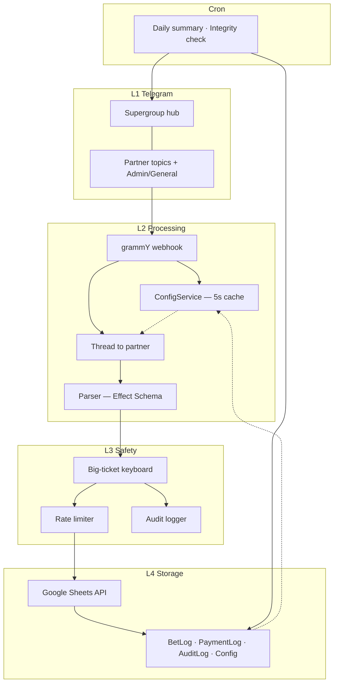

# Ash Settlement Bot

> Telegram supergroup bot for partner bet logging and settlement — Google Sheets as the source of truth.

| | |
|---|---|
| **Version** | Spec v2.6 |
| **Status** | Documentation and design complete · **implementation not started** |
| **Repo** | [brendadeeznuts1111/bet-turnin-sheet](https://github.com/brendadeeznuts1111/bet-turnin-sheet) |

## Contents

- [What it is](#what-it-is)
- [Design principles](#design-principles)
- [How it works](#how-it-works)
- [Tech stack](#tech-stack)
- [Reference registry](#reference-registry) — [refs.json](refs.json) (SSOT) · [REFS.md](REFS.md) (DOC-04)
- [Commands](#commands-quick-reference)
- [Configuration](#configuration)
- [Google Sheets](#google-sheets)
- [Scheduled jobs](#scheduled-jobs)
- [Environment](#environment-planned)
- [Documentation](#documentation)
- [Roadmap](#roadmap)

---

## What it is

**Ash Settlement Bot** (`@TurnInLoggerBot`) runs inside a Telegram **supergroup with forum topics**. Each betting partner gets a dedicated topic; the bot maps every command to a partner via `message_thread_id` — it never infers partner from `@mentions` inside partner topics.

All bets, payments, and audit events append to **Google Sheets**. Sheet formulas compute P&L and running totals. Ash edits partners, thresholds, and cron schedules in the live **Config** tab — no redeploy required.

### `/logbet` syntax

```bash
/logbet <date> "<event>" <odds> <risk> <W|L|P>
```

| Argument | Example | Notes |
|----------|---------|-------|
| `date` | `2026-06-20` | `YYYY-MM-DD`, must be today or earlier |
| `event` | `"mulch account"` | Quoted string, 3–200 chars |
| `odds` | `100` | American odds (non-zero integer) |
| `risk` | `5750` | Dollars staked, must be > 0.01 |
| `W/L/P` | `L` | Win, loss, or push |

```bash
/logbet 2026-06-20 "mulch account" 100 5750 L
```

When `risk` exceeds `big_ticket_threshold` (default **$5,000**), the bot shows an inline **Confirm / Cancel** keyboard before writing to the sheet. See the [big-ticket flow in the spec demo](spec.html#mockup).

---

## Design principles

1. **Strict topic mapping** — one forum topic per partner; wrong topic = rejected command.
2. **Sheets as truth** — bot writes rows; formulas own math (`Result`, `Running_Total`).
3. **Typed payloads** — Effect Schema [E02](REFS.md#ref-e02) validates every field before a write.
4. **Human-in-the-loop for big tickets** — inline keyboard [T03](REFS.md#ref-t03) on high-risk bets.
5. **Live config** — Config tab [S03](REFS.md#ref-s03) reloads every 5 seconds.
6. **Audit trail** — confirm, cancel, override, and settle actions logged to AuditLog.

Full rules: [SPEC-07](REFS.md#ref-spec-07) in [spec.html#rules-summary](spec.html#rules-summary).

---

## How it works

Four layers plus an autonomous cron scheduler:



- **Architecture deep-dive:** [OUTLINE.md](OUTLINE.md#architecture-layers)
- **Full flow diagram:** [spec.html#architecture](spec.html#architecture)

---

## Tech stack

| Component | Role |
|-----------|------|
| Bun [B01](REFS.md#ref-b01) | Runtime — [B03](REFS.md#ref-b03) HTTP · [B04](REFS.md#ref-b04) cron · [B05](REFS.md#ref-b05) env |
| Effect [E01](REFS.md#ref-e01) | [E02](REFS.md#ref-e02) Schema · [E03](REFS.md#ref-e03) Layers · [E04](REFS.md#ref-e04) Retry |
| grammY [T01](REFS.md#ref-t01) | [T02](REFS.md#ref-t02) Webhooks · [T03](REFS.md#ref-t03) Keyboards |
| Google Sheets [S01](REFS.md#ref-s01) | [S02](REFS.md#ref-s02) Append · [S04](REFS.md#ref-s04) Service account |

---

## Reference registry

- **[refs.json](refs.json)** — machine-readable SSOT (validated by audit); all external (B01–S05), internal spec (SPEC-01–SPEC-09), and document (DOC-01–DOC-04) IDs.
- **[REFS.md](REFS.md)** (DOC-04) — human-readable view (URLs synced to refs.json).

| Prefix | Range | Meaning | Registry |
|--------|-------|---------|----------|
| B | B01–B08 | Bun | [REFS.md#bun-b01-b08](REFS.md#bun-b01-b08) |
| E | E01–E05 | Effect | [REFS.md#effect-e01-e05](REFS.md#effect-e01-e05) |
| T | T01–T05 | grammY / Telegram | [REFS.md#grammy-telegram-t01-t05](REFS.md#grammy-telegram-t01-t05) |
| S | S01–S05 | Google Sheets | [REFS.md#google-sheets-s01-s05](REFS.md#google-sheets-s01-s05) |
| SPEC | SPEC-01–SPEC-09 | [spec.html](spec.html) sections | [REFS.md#internal-spec-sections](REFS.md#internal-spec-sections) |
| DOC | DOC-01–DOC-04 | Project markdown / spec files | [REFS.md#project-documents](REFS.md#project-documents) |

Quick links: [Bun (B01–B08)](REFS.md#bun-b01-b08) · [Effect (E01–E05)](REFS.md#effect-e01-e05) · [grammY/Telegram (T01–T05)](REFS.md#grammy-telegram-t01-t05) · [Sheets (S01–S05)](REFS.md#google-sheets-s01-s05) · [Spec (SPEC-01–09)](REFS.md#internal-spec-sections) · [Matrix](REFS.md#cross-reference-matrix)

Field-by-field config: [SPEC-02](REFS.md#ref-spec-02) · Command matrix: [SPEC-04](REFS.md#ref-spec-04) · Key pairings: [REFS.md#key-pairings](REFS.md#key-pairings) · Category tables: [OUTLINE.md](OUTLINE.md#bun-api-references)

---

## Commands (quick reference)

| Command | Context | Result | Ref IDs |
|---------|---------|--------|---------|
| `/logbet ...` | Partner topic | Log bet for mapped partner | [SPEC-04](REFS.md#ref-spec-04) · [T04](REFS.md#ref-t04) · [E02](REFS.md#ref-e02) · [S02](REFS.md#ref-s02) |
| `/logbet ...` | General topic | **Rejected** | [SPEC-04](REFS.md#ref-spec-04) · [SPEC-07](REFS.md#ref-spec-07) |
| `/status` | Partner topic | Last 5 bets + running total | [SPEC-04](REFS.md#ref-spec-04) · [S03](REFS.md#ref-s03) |
| `/settle` | Partner topic | Running total for that partner | [SPEC-04](REFS.md#ref-spec-04) |
| `/settle` | General topic | Master total across all partners | [SPEC-04](REFS.md#ref-spec-04) · [SPEC-07](REFS.md#ref-spec-07) |
| `/settle @mike` | General topic | Total for named partner | [SPEC-04](REFS.md#ref-spec-04) |
| `/payment ...` | Partner topic | Log payment (negative = Ash pays out) | [SPEC-04](REFS.md#ref-spec-04) · [S02](REFS.md#ref-s02) |
| `/listpartners` | Any topic | List active partners | [SPEC-04](REFS.md#ref-spec-04) · [SPEC-02](REFS.md#ref-spec-02) |

Extended commands and full behavior matrix: [SPEC-04](REFS.md#ref-spec-04) in [spec.html#command-matrix](spec.html#command-matrix) · [OUTLINE — Command catalog](OUTLINE.md#command-catalog).

### Examples

```bash
/logbet 2026-06-20 "mulch account" 100 5750 L
/status
/settle
/payment 500 venmo "weekly settle"
```

---

## Configuration

**Production:** Config tab in the Google Sheet (5-second cache).

**Development:** Local JSON file with the same schema (`config.example.json` when implemented).

```json
{
  "hub": {
    "chat_id": -1001234567890,
    "name": "Ash Settlement Hub",
    "general_topic_id": 104
  },
  "partners": [
    { "key": "eddie", "thread_id": 101, "display_name": "Eddie", "is_active": true },
    { "key": "mike", "thread_id": 102, "display_name": "Mike", "is_active": true },
    { "key": "stacks", "thread_id": 103, "display_name": "Stacks", "is_active": true }
  ],
  "admin_user_ids": [123456789, 987654321],
  "rate_limit": { "commands_per_minute": 10, "burst_size": 3 },
  "big_ticket_threshold": 5000,
  "scheduled_jobs": {
    "timezone": "America/Los_Angeles",
    "daily_summary": { "cron": "0 9 * * *", "enabled": true },
    "weekly_report": { "cron": "0 9 * * 1", "enabled": false }
  }
}
```

Field-by-field reference: [SPEC-02](REFS.md#ref-spec-02) · [spec.html#hub-config](spec.html#hub-config).

---

## Google Sheets

| Tab | Purpose | Ref IDs |
|-----|---------|---------|
| **BetLog** | Bet history; formulas compute `Result` and `Running_Total` | [SPEC-06](REFS.md#ref-spec-06) · [S02](REFS.md#ref-s02) |
| **PaymentLog** | Settlement payments | [SPEC-06](REFS.md#ref-spec-06) · [S02](REFS.md#ref-s02) |
| **AuditLog** | Immutable action log (confirm, cancel, overrides) | [SPEC-06](REFS.md#ref-spec-06) · [S02](REFS.md#ref-s02) |
| **Config** | Live bot configuration | [SPEC-02](REFS.md#ref-spec-02) · [S03](REFS.md#ref-s03) |

BetLog columns (A–M):

```
Timestamp | Partner | Thread_ID | User_ID | Date | Event | Odds | Risk | W/L | Result | Running_Total | Notes | Admin_Override
```

Column contracts: [SPEC-06](REFS.md#ref-spec-06) · [spec.html#sheet-contracts](spec.html#sheet-contracts).

---

## Scheduled jobs

All times use `scheduled_jobs.timezone` (default `America/Los_Angeles`).

| Job | Schedule | Output | Ref IDs |
|-----|----------|--------|---------|
| Daily summary | `0 9 * * *` | Yesterday's P&L digest → Admin topic | [SPEC-03](REFS.md#ref-spec-03) · [B04](REFS.md#ref-b04) |
| Weekly report | `0 9 * * 1` | PDF for prior week → Admin topic | [SPEC-03](REFS.md#ref-spec-03) |
| Integrity check | `0 0 * * *` | `/check` for all partners; mismatches → AuditLog | [SPEC-03](REFS.md#ref-spec-03) · [B04](REFS.md#ref-b04) |
| Leaderboard cache | `0 18 * * *` | Refreshes cached rankings | [SPEC-03](REFS.md#ref-spec-03) |

Details: [SPEC-03](REFS.md#ref-spec-03) · [spec.html#scheduled-jobs](spec.html#scheduled-jobs) · [B04](REFS.md#ref-b04)

---

## Environment (planned)

Setup guide will ship with Phase 1 implementation. Expected variables ([B05](REFS.md#ref-b05) · [B06](REFS.md#ref-b06) · [S04](REFS.md#ref-s04)):

```bash
TELEGRAM_BOT_TOKEN=
TELEGRAM_WEBHOOK_SECRET=
GOOGLE_SHEETS_ID=
GOOGLE_SERVICE_ACCOUNT_JSON=   # file path or inline JSON
CONFIG_CACHE_TTL_MS=5000
```

---

## Documentation

| Document | Ref ID | Use when you need… |
|----------|--------|-------------------|
| **[refs.json](refs.json)** | — | Machine-readable Ref registry (SSOT) |
| **[REFS.md](REFS.md)** | [DOC-04](REFS.md#ref-doc-04) | Human-readable Ref registry — B/E/T/S, SPEC, DOC |
| **[ref-audit.json](ref-audit.json)** / **[ref-audit.md](ref-audit.md)** | — | Latest audit reports |
| **[README.md](README.md)** | [DOC-01](REFS.md#ref-doc-01) | Overview and quick reference |
| **[OUTLINE.md](OUTLINE.md)** | [DOC-02](REFS.md#ref-doc-02) | Architecture, phases, acceptance criteria |
| **[spec.html](spec.html)** | [DOC-03](REFS.md#ref-doc-03) | Full v2.6 spec, interactive demo |

```bash
bun run audit:refs              # full audit
bun run audit:refs --fix        # update lastChecked in refs.json
bun run audit:refs --strict     # fail on warnings (pre-signoff gate)
bun run audit:refs:offline      # drift check without network
bun run audit:refs --no-cache   # bypass 24h URL cache
```

**Governance:** No GitHub Actions — run audit locally, then record **domain signoffs** per external group (B/E/T/S) in [REFS.md#domain-signoffs](REFS.md#domain-signoffs).

```bash
open spec.html   # macOS — open in default browser
```

---

## Roadmap

| Phase | Scope | Status | Ref IDs · OUTLINE |
|-------|-------|--------|-------------------|
| **0** | Docs + spec alignment | Done | [Phase 0](OUTLINE.md#phase-0) · [SPEC-08](REFS.md#ref-spec-08) |
| **1** | Config in Sheets (5s cache) | Pending | [Phase 1](OUTLINE.md#phase-1) · [SPEC-02](REFS.md#ref-spec-02) |
| **2** | Core path: `/logbet` + sheet write | Pending | [Phase 2](OUTLINE.md#phase-2) · [SPEC-04](REFS.md#ref-spec-04) · [SPEC-06](REFS.md#ref-spec-06) |
| **3** | Big-ticket inline keyboard | Pending | [Phase 3](OUTLINE.md#phase-3) · [SPEC-05](REFS.md#ref-spec-05) · [T03](REFS.md#ref-t03) |
| **4** | Daily summary cron | Pending | [Phase 4](OUTLINE.md#phase-4) · [SPEC-03](REFS.md#ref-spec-03) |
| **5** | Integrity check cron | Pending | [Phase 5](OUTLINE.md#phase-5) · [SPEC-03](REFS.md#ref-spec-03) |
| **6** | Parlay, `/editbet`, leaderboard, weekly PDF | Pending | [Phase 6](OUTLINE.md#phase-6) · [SPEC-09](REFS.md#ref-spec-09) |

Per-phase acceptance criteria: [OUTLINE.md#implementation-phases](OUTLINE.md#implementation-phases).

---

## License

[MIT](LICENSE) — documentation and audit tooling in this repository.
